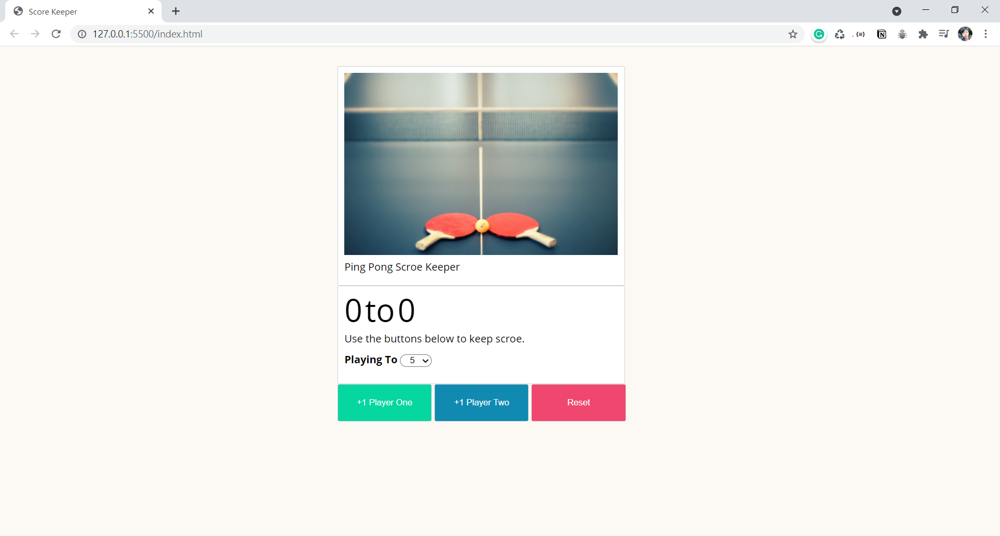

# Ping Pong Score Keeper

This is the section 26 exercise in the [The Web Developer Bootcamp 2021](https://www.udemy.com/course/the-web-developer-bootcamp/) (by Colt Steele) 

I wrote the layout in CSS on my own. It's a great exercise to practice the JavaScript DOM and EventListener. By spending extra time on the CSS layout, I got more familiar with CSS and tried more detailed button actions designs.

### ScreenShot

### Try it!

